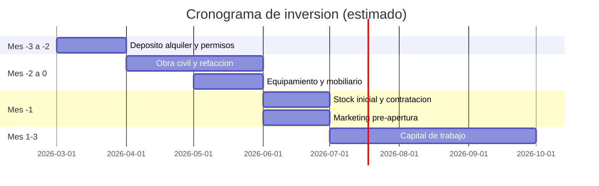

# Inversion Inicial

> [!info] Criterio monetario y fecha de estimacion
> Moneda operativa: ARS. Moneda de referencia para inversion total: USD (~1.200 ARS/USD, febrero 2026).
> Estimacion basada en precios de mercado y experiencia operativa de la socia.

## Supuestos generales

- Dos locales simultaneos en Guaymallen (Dorrego y Villa Nueva).
- Locales alquilados, 80-120 m2 cada uno.
- Requieren refaccion completa (obra civil, instalaciones, habilitacion).
- Equipamiento de barra (maquina espresso + molinillo) puede ser en comodato o compra.

## Desglose de inversion por local

### Obra civil y acondicionamiento

| Concepto | Estimacion (ARS) |
|---|---|
| Refaccion integral (pisos, paredes, bano, electricidad, gas, plomeria) | $15.000.000 - $25.000.000 |
| Construccion de barra, mesadas e instalacion de cocina | $5.000.000 - $8.000.000 |
| Carteleria y senaletica exterior/interior | $500.000 - $1.500.000 |
| Decoracion e identidad visual del espacio | $2.000.000 - $4.000.000 |
| **Subtotal obra y acondicionamiento** | **$22.500.000 - $38.500.000** |

### Equipamiento de barra

Se presentan dos escenarios segun la modalidad de adquisicion.

**Escenario A: Comodato** (el proveedor de cafe presta maquina y molinillo a cambio de acuerdo de compra exclusiva de grano):

| Concepto | Estimacion (ARS) |
|---|---|
| Maquina de espresso | $0 (comodato) |
| Molinillo comercial | $0 (comodato) |
| Equipo de filtrado (V60, Chemex, kettles, balanzas) | $500.000 - $1.000.000 |
| **Subtotal barra (comodato)** | **$500.000 - $1.000.000** |

**Escenario B: Compra**:

| Concepto | Estimacion (ARS) |
|---|---|
| Maquina de espresso (doble grupo, gama profesional) | $8.000.000 - $15.000.000 |
| Molinillo comercial | $2.000.000 - $5.000.000 |
| Equipo de filtrado (V60, Chemex, kettles, balanzas) | $500.000 - $1.000.000 |
| **Subtotal barra (compra)** | **$10.500.000 - $21.000.000** |

> [!info] Trade-off del comodato
> El comodato reduce la inversion inicial significativamente pero implica un acuerdo de exclusividad con el proveedor de cafe. Esto puede limitar la flexibilidad de cambiar de tostador o negociar precios. La decision depende de la relacion con el proveedor y las condiciones del contrato.

### Equipamiento de cocina

| Concepto | Estimacion (ARS) |
|---|---|
| Horno comercial | $2.000.000 - $4.000.000 |
| Heladera y freezer comercial | $1.500.000 - $2.500.000 |
| Bajo mesada refrigerado | $1.000.000 - $1.500.000 |
| Utensilios y equipamiento menor de cocina | $500.000 - $1.000.000 |
| **Subtotal cocina** | **$5.000.000 - $9.000.000** |

### Mobiliario y vajilla

| Concepto | Estimacion (ARS) |
|---|---|
| Mesas y sillas (40 cubiertos) | $3.000.000 - $5.000.000 |
| Barra de atencion y banquetas | $1.000.000 - $2.000.000 |
| Vajilla, cristaleria, cubiertos | $1.000.000 - $1.500.000 |
| Accesorios de servicio (bandejas, jarras, etc.) | $500.000 - $1.000.000 |
| **Subtotal mobiliario y vajilla** | **$5.500.000 - $9.500.000** |

### Tecnologia

| Concepto | Estimacion (ARS) |
|---|---|
| Sistema POS (hardware + software) | $300.000 - $800.000 |
| Pantalla de pedidos / cocina | $200.000 - $400.000 |
| Instalacion de red y conectividad | $200.000 - $300.000 |
| **Subtotal tecnologia** | **$700.000 - $1.500.000** |

### Gastos pre-operativos

| Concepto | Estimacion (ARS) |
|---|---|
| Habilitaciones municipales y permisos | $500.000 - $1.500.000 |
| Deposito de alquiler (2-3 meses) | $2.000.000 - $4.000.000 |
| Stock inicial (cafe, alimentos, descartables, limpieza) | $2.000.000 - $3.000.000 |
| Contratacion y capacitacion de equipo (6 personas) | $1.000.000 - $2.000.000 |
| Marketing de pre-apertura y lanzamiento | $1.000.000 - $2.000.000 |
| **Subtotal pre-operativos** | **$6.500.000 - $12.500.000** |

### Capital de trabajo (primeros 3 meses)

Cubre salarios, alquiler, insumos y gastos operativos durante los primeros 3 meses de operacion mientras el local alcanza su ritmo de ventas.

| Concepto | Estimacion mensual (ARS) | Total 3 meses (ARS) |
|---|---|---|
| Sueldos (6 personas) | $4.500.000 - $6.000.000 | $13.500.000 - $18.000.000 |
| Alquiler + expensas | $800.000 - $1.500.000 | $2.400.000 - $4.500.000 |
| Insumos y mercaderia | $2.000.000 - $3.000.000 | $6.000.000 - $9.000.000 |
| Servicios (luz, gas, agua, internet) | $300.000 - $500.000 | $900.000 - $1.500.000 |
| **Subtotal capital de trabajo** | | **$22.800.000 - $33.000.000** |

## Resumen de inversion total (2 locales)

### Escenario A: Equipamiento de barra en comodato

| Categoria | Por local (ARS) | 2 locales (ARS) |
|---|---|---|
| Obra y acondicionamiento | $22.500.000 - $38.500.000 | $45.000.000 - $77.000.000 |
| Barra (comodato) | $500.000 - $1.000.000 | $1.000.000 - $2.000.000 |
| Cocina | $5.000.000 - $9.000.000 | $10.000.000 - $18.000.000 |
| Mobiliario y vajilla | $5.500.000 - $9.500.000 | $11.000.000 - $19.000.000 |
| Tecnologia | $700.000 - $1.500.000 | $1.400.000 - $3.000.000 |
| Pre-operativos | $6.500.000 - $12.500.000 | $13.000.000 - $25.000.000 |
| Capital de trabajo (3 meses) | $22.800.000 - $33.000.000 | $45.600.000 - $66.000.000 |
| **Total con comodato** | **$63.500.000 - $105.000.000** | **$127.000.000 - $210.000.000** |
| **Total en USD (ref.)** | **USD 52.900 - 87.500** | **USD 105.800 - 175.000** |

### Escenario B: Equipamiento de barra comprado

| Diferencia sobre escenario A | Por local (ARS) | 2 locales (ARS) |
|---|---|---|
| Equipamiento barra adicional | +$10.000.000 - $20.000.000 | +$20.000.000 - $40.000.000 |
| **Total con compra** | **$73.500.000 - $125.000.000** | **$147.000.000 - $250.000.000** |
| **Total en USD (ref.)** | **USD 61.250 - 104.200** | **USD 122.500 - 208.300** |

## Contingencia

Se recomienda reservar un 10% adicional sobre la inversion total como fondo de contingencia para imprevistos de obra, demoras de apertura o ajustes operativos.

| Escenario | Inversion base (punto medio, 2 locales) | Contingencia 10% | Total con contingencia |
|---|---|---|---|
| Comodato | ~ARS 168.500.000 | ~ARS 16.850.000 | **~ARS 185.350.000 (~USD 154.500)** |
| Compra | ~ARS 198.500.000 | ~ARS 19.850.000 | **~ARS 218.350.000 (~USD 181.900)** |

## Cronograma estimado de desembolso

## Limites de estimacion

1. Los rangos reflejan variabilidad de mercado (febrero 2026). Los precios deben validarse con cotizaciones concretas al momento de ejecutar.
2. El tipo de cambio ARS/USD puede variar significativamente. Los valores en USD son referenciales.
3. El capital de trabajo supone rampa de ventas gradual. Si la demanda es mas lenta, puede requerirse extension.
4. La contingencia del 10% cubre imprevistos tipicos pero no escenarios extremos.

---

**Documentos relacionados**: [[Costos-Fijos-y-Variables]] | [[Proyeccion-de-Ventas]] | [[ROI-y-Payback]] | [[Resumen-Financiero]]

Ver planilla detallada: `financials/Inversion-Inicial.xlsx`
